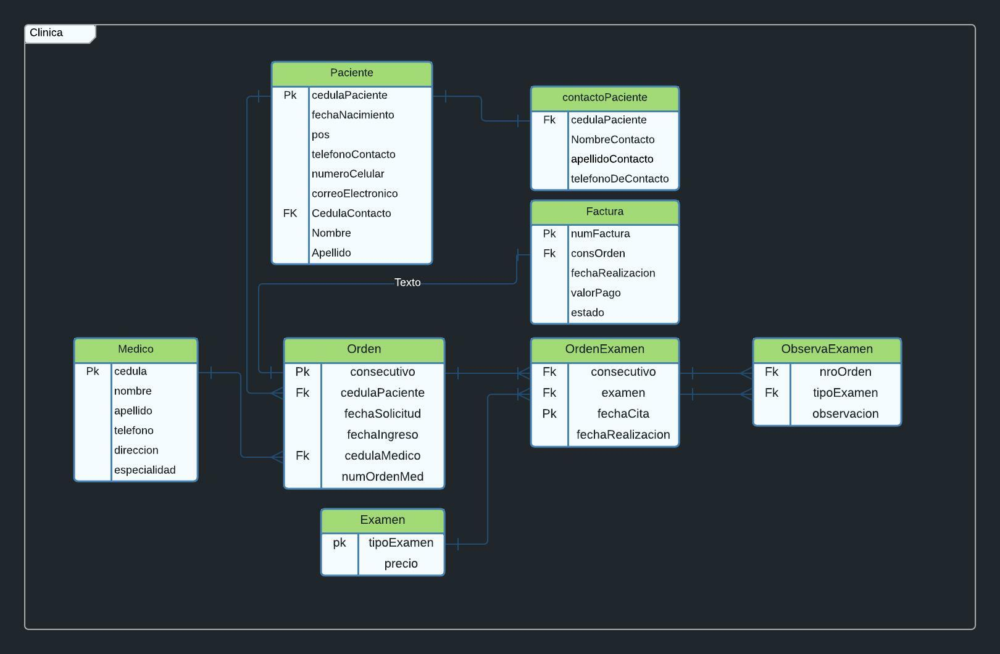
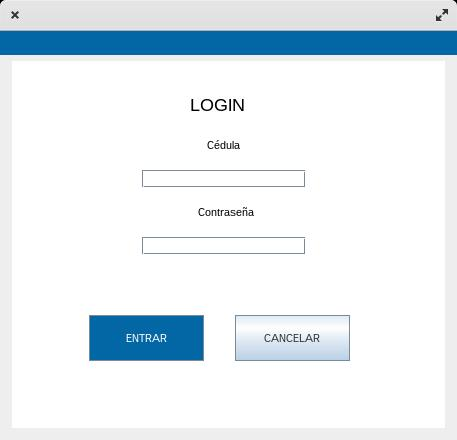
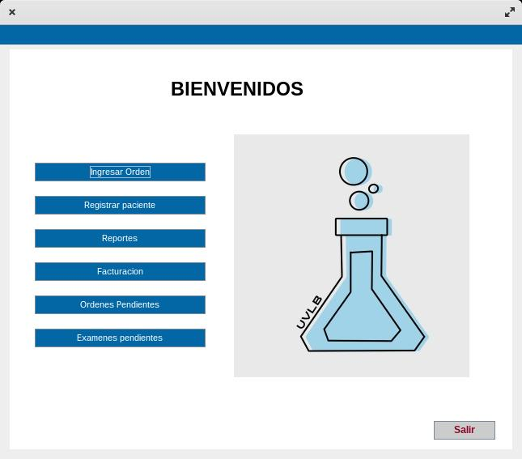
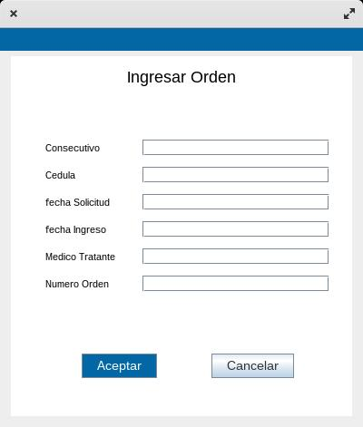
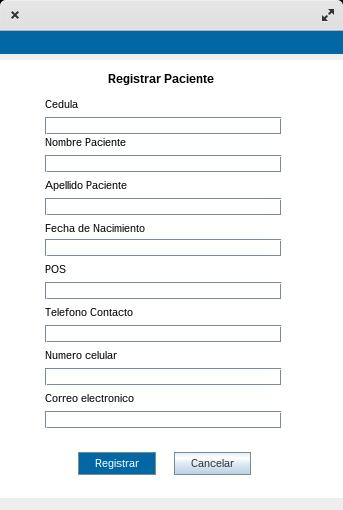
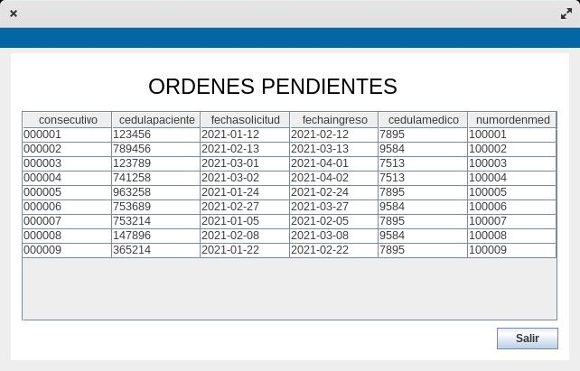
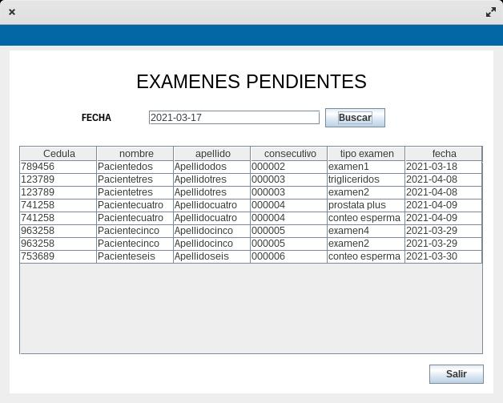

# LABORATORIO CLINICO
(proyecto del curso - Base de Datos)

## Participantes

https://github.com/auraPasmin

https://github.com/tsubakijuju13

https://github.com/mrHann69

Diagrama MER

login

principal

ingresar orden

registrar paciente

ordenes pendientes

examenes pendientes

